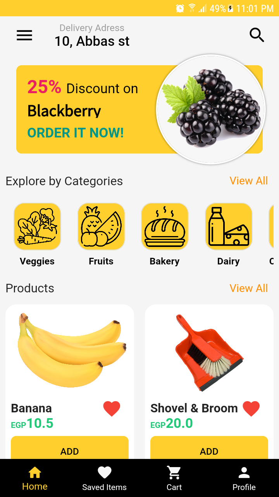
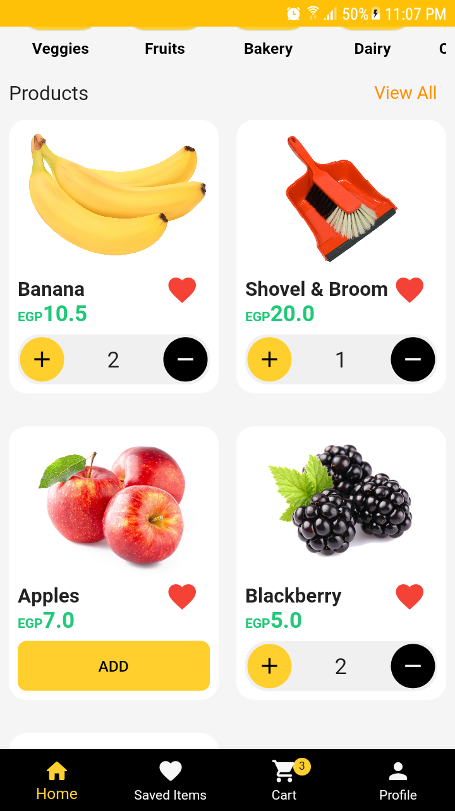
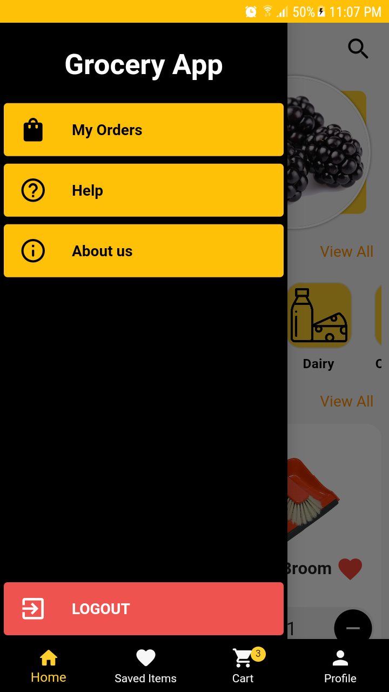
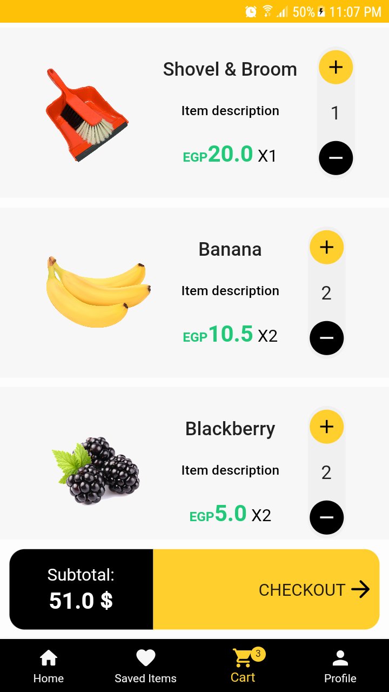
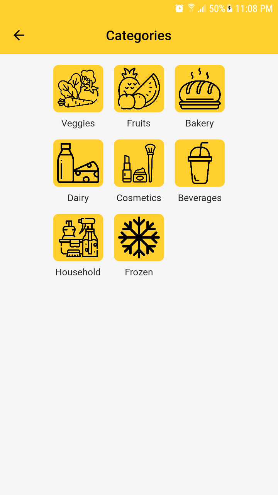
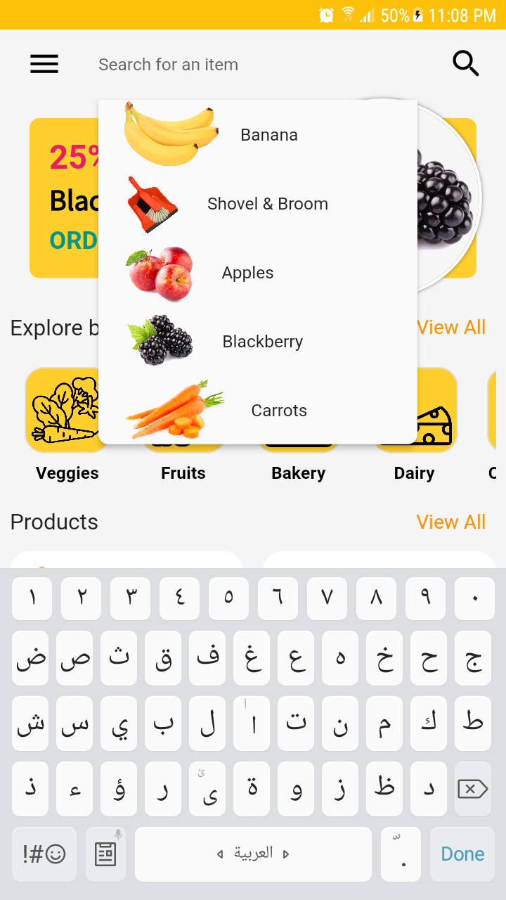

## Convenience store app
An E-commerce app built using Flutter.
* Developed using clean architecture.
* Managed the app state using Cubit.
* Attached it to a Firebase RTDB to handle the CRUD operations.
*	Used Google Maps service to enable users to set their location.
  
|
|
|
|
|
|
